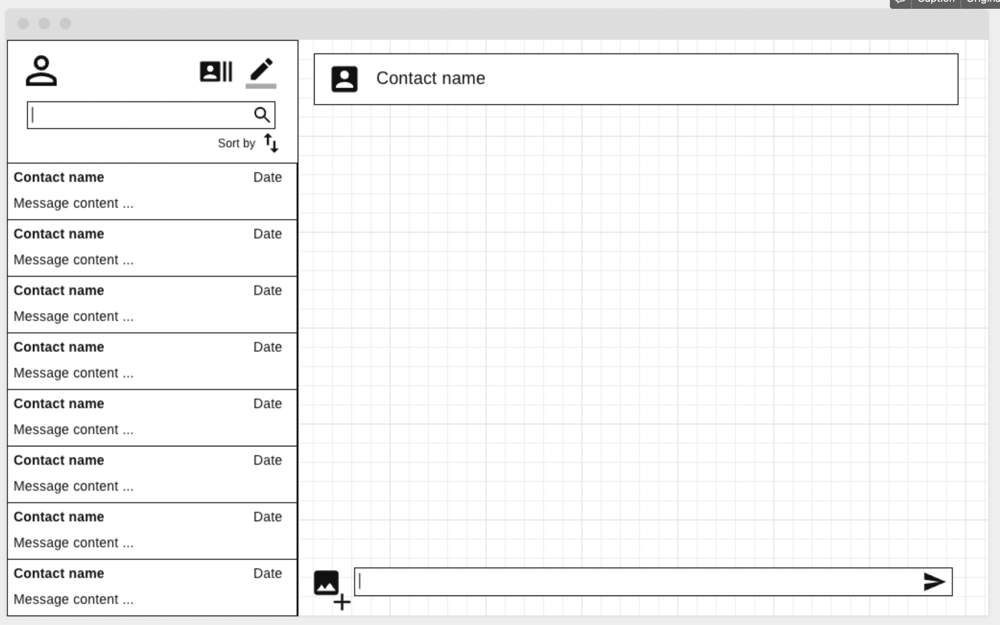

# MessagingApp

This is a simple Messaging App, with messages one to one user. The app it's connected to an API(<https://messagingapp--api.herokuapp.com/>), source code can be found here <https://github.com/juliobarriga/MessagingApp_API>.

This project was generated with [Angular CLI]<https://github.com/angular/angular-cli> version 13.2.2.

## Deployment

This app was deployed in Heroku. Navigate to <https://messaging--app.herokuapp.com/> to open the app. 

## User Stories
- As a user, I want to register so that I can create a new account.
- As a user, I want to login so that I can see my conversations home page.
- As a user, I want to see my active conversations so that I can see the user and the last message shared.
- As a logged in user, I want to logout from my account so that other user can log in.
- As a user, I want to write a new message in an existing conversation so that I can reply a message.
- As a user, I want to see the time a message was sent or received.
- As a user, I want to start a new conversation with any user in the database. 

## Wireframe



## Project Structure
```
./src/app/
├── _helpers
├── _models
│   ├── message.ts
│   ├── user.ts
│   └── userCredentials.ts
├── _services
│   ├── auth.service.ts
│   ├── registration.service.ts
│   ├── token-storage.service.ts
│   └── user.service.ts
├── app-routing.module.ts
├── app.component.css
├── app.component.html
├── app.component.spec.ts
├── app.component.ts
├── app.module.ts
├── authentication
│   ├── authentication.component.css
│   ├── authentication.component.html
│   ├── authentication.component.spec.ts
│   ├── authentication.component.ts
│   ├── authentication.routing.module.ts
│   ├── login
│   │   ├── login.component.css
│   │   ├── login.component.html
│   │   ├── login.component.spec.ts
│   │   └── login.component.ts
│   └── register
│       ├── register.component.css
│       ├── register.component.html
│       ├── register.component.spec.ts
│       └── register.component.ts
└── conversation
    ├── chat
    │   ├── chat.component.css
    │   ├── chat.component.html
    │   ├── chat.component.spec.ts
    │   └── chat.component.ts
    ├── conversation.component.css
    ├── conversation.component.html
    ├── conversation.component.spec.ts
    ├── conversation.component.ts
    └── conversation.routing.module.ts
```
